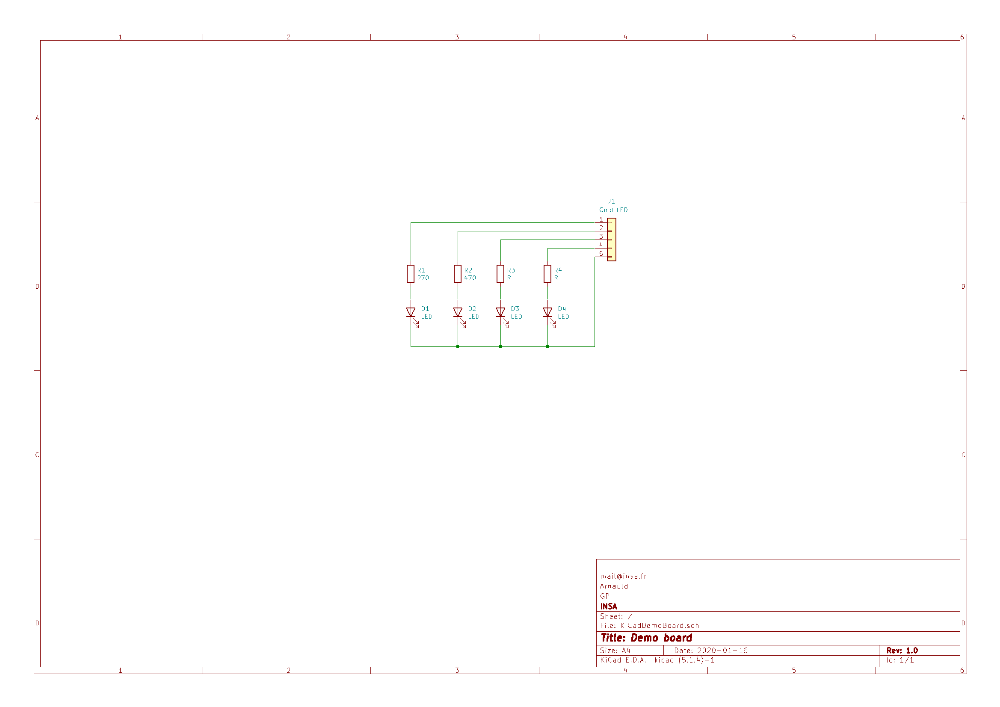

# SecondProjectGP2020

Démo de mise en oeuvre de KiCad

[Contact](mail@insa.fr)

## Hardware ESP32

## TODO:

- [x] Créer un nouveau projet KiCad
- [x] Créer un montage simple à base de LED
- [ ] Créarion du PCB

## Mon schema

